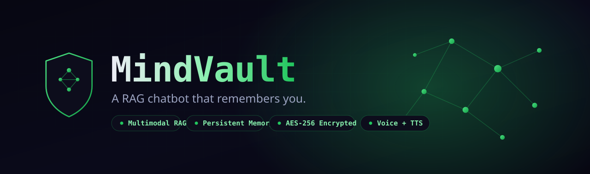

<div align="center">



# MindVault

### A personal multimodal RAG chatbot that **remembers you** — upload documents, ask questions, get grounded cited answers. Encrypted at rest, voice-ready, and built to fail over, never fall over.

<sub>rag chatbot · retrieval augmented generation · personal ai assistant · multimodal rag · mem0 memory · vector search · qdrant · pinecone · fastapi · nextjs · langchain alternative · document q&a · pdf chat · aes-256 encryption · argon2 · jwt auth · provider fallback · groq · cerebras · voyage embeddings</sub>

[](https://www.python.org/)
[](https://nextjs.org/)
[](https://fastapi.tiangolo.com/)
[](#-tests)
[](LICENSE)
[]()

**Most RAG demos forget you the moment you close the tab.** MindVault is a private knowledge assistant that learns from your documents *and* remembers the person asking — encrypted end to end, with automatic provider fail-over so a single rate limit never breaks the experience.

[Why it exists](#-why-this-exists) · [Features](#-features) · [Architecture](#-architecture) · [How it works](#-how-it-works) · [Quick start](#-quick-start) · [Security](#-security) · [Roadmap](#-roadmap)

</div>

---

## 💡 Why this exists

Calling an LLM API is easy. Building a system that is **grounded, private, and resilient** is the actual engineering — and that is what gets you hired.

MindVault is a portfolio-grade build that demonstrates depth across the AI-engineering stack, not just a wrapper around one model:

- **Grounded, not hallucinated** — answers come from *your* documents, with citations, and it refuses when the answer isn't there.
- **Remembers you** — a memory layer separates *document knowledge* (RAG) from *facts about the user* (long-term memory), so conversations build on each other.
- **Private by default** — every uploaded file is AES-256-GCM encrypted at rest; passwords are Argon2id; auth is JWT access + refresh.
- **Never falls over** — every provider (LLM, embeddings, vector store, speech) sits behind a `FallbackRouter` that fails over across providers *and* across keys.

---

## ✨ Features

| | Feature | What it shows |
|---|---|---|
| 🔐 | **AES-256-GCM at rest** | Blob + field-level encryption with AAD binding ciphertext to its owner |
| 🛡️ | **Argon2id + JWT** | Modern password hashing (not bcrypt) + stateless access/refresh tokens |
| 🔁 | **Provider FallbackRouter** | Auto fail-over across providers **and** multiple keys per provider |
| 🧱 | **Dual vector store** | Qdrant Cloud primary → Pinecone fallback, same interface |
| ✂️ | **Token-aware chunking** | tiktoken-based, ~600 tokens with 80-token overlap |
| 📚 | **Cited, grounded answers** | Strong system prompt: cite sources, refuse when not in documents |
| 🧠 | **Dual-context memory** | Document RAG **+** persistent memory about the user *(Mem0)* |
| 🎙️ | **Voice-ready** | STT + TTS provider routers wired (Deepgram, Cartesia, Sarvam, Murf) |
| 🚦 | **Rate limiting** | Per-IP SlowAPI limits on auth + chat endpoints |
| ✅ | **Admin approval flow** | New sign-ups gated; one-click email approval (Resend + signed JWT) |
| 🌌 | **3D animated landing** | Three.js particle-network hero, scroll-reveal, full marketing page |

---

## 🏗️ Architecture

```
Next.js 15 / React 19            FastAPI (async)                   Data
──────────────────────           ──────────────────────            ──────────────────────
3D landing + auth          ──►   /auth   JWT + Argon2         ──►  Supabase Postgres (RLS)
Chat UI + citations        ──►   /chat   RAG + memory         ──►  Qdrant Cloud → Pinecone
Upload (PDF / doc)         ──►   /ingest chunk + embed + AES  ──►  Encrypted blob store
Admin approval dashboard   ──►   /admin  status workflow           Mem0 (long-term memory)
Voice (STT / TTS)          ──►   /stt /tts  FallbackRouter
```

**FallbackRouter** — the reusable core. Every modality iterates ordered *slots*, where each slot is one `(provider, key)` pair. On `QuotaError` or `ProviderUnavailable` it advances to the next slot; `AllProvidersFailed` is raised only when every slot is exhausted. Each call records which slot served the request.

```
LLM         Groq (5 keys)  →  Cerebras (2 keys)
Embeddings  Voyage (2 keys) →  Gemini (2 keys)
Vectors     Qdrant Cloud    →  Pinecone
STT         Deepgram        →  Cartesia (4 keys)
TTS         Cartesia (4)    →  Sarvam (7) → Murf
```

---

## 🔬 How it works

**Ingestion**
```
PDF / text ─► encrypt + store blob ─► extract text ─► token-aware chunk
          ─► embed (router) ─► upsert to vector store (payload: user_id, doc_id, source)
```

**Retrieval & answer**
```
question ─► embed ─► similarity search (filtered by user_id)
        ─► build grounded prompt (top-k chunks + user memory)
        ─► LLM (router) ─► streamed answer + citations
```

Per-user isolation is enforced at the vector-store payload filter *and* at the database row level (Supabase RLS), so one user can never retrieve another's documents.

---

## 🧰 Tech stack

**Backend** · FastAPI · Python 3.10+ · Pydantic v2 · uvicorn · SlowAPI · Argon2 · cryptography · tiktoken
**Frontend** · Next.js 15 · React 19 · TypeScript · Tailwind CSS · Three.js
**Data** · Supabase (Postgres + RLS) · Qdrant Cloud · Pinecone · Mem0
**Providers** · Groq · Cerebras · Voyage · Gemini · Deepgram · Cartesia · Sarvam · Murf · Resend

---

## 🚀 Quick start

**Requirements:** Python 3.10+, Node 18+, Docker (optional — only for local Qdrant)

```powershell
# 1. Backend
cd backend
python -m venv .venv
.venv\Scripts\pip install -r requirements.txt
copy ..\.env.example .env          # fill in keys (see below)
python -m uvicorn app.main:app --reload

# 2. Frontend
cd ..\frontend
npm install
npm run dev
```

Open **http://localhost:3000** — sign up, upload a PDF, ask a question.
API docs at **http://localhost:8000/docs**.

**Generate the required secrets once:**
```powershell
python -c "import secrets; print(secrets.token_urlsafe(64))"          # JWT secret
python -c "import os,base64; print(base64.b64encode(os.urandom(32)).decode())"  # AES master key
```

**Required API keys** (all have free tiers):
| Service | Where |
|---|---|
| Groq | `console.groq.com` |
| Voyage | `dash.voyageai.com` |
| Gemini | `aistudio.google.com` |
| Supabase | `supabase.com` |
| Qdrant Cloud | `cloud.qdrant.io` |
| Pinecone | `console.pinecone.io` *(index: 1024 dims, cosine)* |

---

## 🔐 Security

- **Encryption at rest** — `encrypt_blob(data, aad)` with AAD = `user_id` binds every ciphertext to its owner. Wire format: 12-byte nonce + ciphertext + tag.
- **Email privacy** — stored as `(encrypt_field(email), sha256(email))`: the hash enables deterministic lookup while the plaintext never touches disk.
- **Passwords** — Argon2id, never reversible.
- **Auth** — short-lived JWT access tokens + refresh rotation.
- **Isolation** — Supabase Row-Level Security + per-user vector payload filters.
- **Abuse limits** — per-IP rate limiting on auth and chat.

> Secrets live only in `.env` (gitignored). The committed `.env.example` is keyless.

---

## 🧪 Tests

```powershell
cd backend
python -m pytest -q
```

**29 unit tests** — provider fallback router, AES-256-GCM crypto, Argon2 auth flow, token-aware chunking, grounded prompt construction.

---

## 🗺️ Roadmap

- [x] **Phase 1** — Auth + text RAG core (grounded cited answers)
- [x] **Phase 1.5** — Admin approval workflow, per-IP rate limiting, 3D landing page
- [ ] **Phase 2** — Mem0 persistent user memory (dual-context prompt)
- [ ] **Phase 3** — Multimodal ingestion (audio / video via STT)
- [~] **Phase 4** — Voice UX: streaming TTS replies ✅ · **mic-mode login** ✅ (speak your email & password, an LLM parses them into the form) · live waveform visualizer ✅
- [ ] **Phase 5** — Observability dashboard + cloud deploy (Vercel + Render)

---

## 🙋 Work with me

I'm **Jeeva** — I build AI systems that are grounded, private, and production-minded.
If this is the kind of engineering your team needs, [open an issue](https://github.com/Jeevav62/mindvault/issues) or reach out.

## 📜 License

MIT — see [LICENSE](LICENSE).
